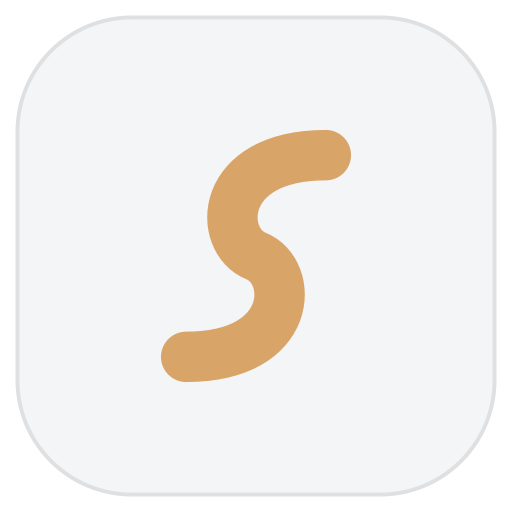

  <picture>
    <source media="(prefers-color-scheme: dark)" srcset="docs/images/logo-dark.svg">
    <source media="(prefers-color-scheme: light)" srcset="docs/images/logo-light.svg">
    
  </picture>

<h1 align="center">Sway</h1>

A cockpit for the coding agents you already run.

Sway is a macOS app that puts every agent session you have going into one
window: a tree of projects and branches, a real terminal per session, an editor
with LSP, and a review panel that stages and commits what the agent wrote. It
does not bundle an agent and it is not tied to one. Claude ships supported out
of the box, and any other CLI agent is a TOML file away.

## Why

Running one agent in one terminal is fine. Running four, across three
repositories and a couple of worktrees, is a tab-management problem, and the
part you actually care about (which one is waiting on you) is the part the
terminal cannot tell you.

Sway watches each agent's own session transcripts and process state, so every
row in the tree says **working**, **needs you**, or **done**, and a parent row
rolls its children up. You look at one list and know where to go next.

## What it does

**Sessions.** A tree of sessions grouped into spaces, with a git-branch graph
and worktree support. Clicking a session focuses its terminal tab, or resumes
it if it is not running. Turn-level checkpoints snapshot the repo per prompt,
so you can diff or revert a single turn. A transcript viewer, a touched-file
list, and a context-window meter come along for adapters that report one.

**Editor and review.** A CodeMirror editor with TypeScript/JavaScript LSP, diff
gutters, and markdown/image preview. The Changes panel stages, unstages,
commits, pushes, and opens a PR. You can send a hunk comment or an editor
selection straight into a session, and search across the whole project.

**Interface.** Command palette (`Cmd+K`), quick open (`Cmd+P`), a shortcut
sheet on `Cmd+/`, and remappable hotkeys. Menu-bar tray, OS notifications, and
a dock badge for sessions that need you. Dark and light themes, and you can
import a VS Code theme file.

## Supported agents

| Agent | Sessions read from | Status detection |
| --- | --- | --- |
| **Claude** (`claude`) | `~/.claude/projects` | Hook-driven, plus transcript and process state |

Sway drives the agent CLIs you have installed; it does not ship one. After
first launch, **Settings > Agents** shows which ones it found, at what version,
and what it can do with each.

Adding another agent does not require a fork. Drop a TOML file into
`~/.config/sway/agents/` describing how to launch it, where its transcripts
live, and how to spot a live process. The schema is documented and stable at
v2, and v1 files still load: see [ADAPTERS.md](ADAPTERS.md).

Only `claude` ships bundled, which is a packaging decision rather than a limit
of the schema. An adapter that omits the optional `[chat]` table runs its agent
as a **PTY tab**, and that is the universal fallback: any CLI you can launch in
a terminal can be driven that way, with the session tree, checkpoints and the
working/needs-you dot around it. What a TOML alone cannot add is a parser for a
transcript shaped unlike claude's, which needs Rust.

## Install

Download the latest `Sway_<version>_universal.dmg` from the
[Releases page](https://github.com/skarif2/sway/releases), drag it into
Applications, then follow **[docs/INSTALL.md](docs/INSTALL.md)** for the first
launch.

Sway v0.1 is **unsigned**, so macOS will refuse to open it the first time. That
is expected. The fix is System Settings > Privacy & Security > **Open Anyway**,
or `xattr -cr /Applications/Sway.app` from a terminal. Both are written out
step by step in [docs/INSTALL.md](docs/INSTALL.md), along with updating and
uninstalling.

**Requirements:** macOS, on Apple Silicon or Intel (the DMG carries a universal
binary). Sway is developed and tested on macOS 15; the bundle sets no minimum
version, so older releases are untested rather than blocked. At least one agent
CLI installed. Node.js if you want the bundled TypeScript language server to
run.

## Privacy

**Sway sends no telemetry.** There is no analytics, no crash reporting, and no
usage tracking of any kind. It makes two network requests on its own behalf,
both anonymous, both at most once a day, both silent on failure:

- **GitHub Releases**, to see whether a newer version of Sway exists. It never
  downloads or installs anything.
- **`openrouter.ai/api/v1/models`**, for the published per-model context-window
  sizes that the context meter reads. It is a public model list, unauthenticated,
  and the response is cached to disk.

Nothing about you, your code, or your sessions is included in either. Use the
app offline to stop both.

**Your agent's own traffic is its own.** A chat tab runs the same `claude` on
your machine that you would run in a terminal, under your own subscription, and
that process talks to its vendor exactly as it always does. Sway starts it,
reads its output and writes to its stdin; it adds no endpoint of its own, proxies
nothing, and sees nothing the CLI would not already be sending. The same goes for
MCP servers: Sway reads and writes Claude's own config files, and Claude, not
Sway, connects to whatever they name. Git pushes and fetches go straight from
the system `git` to your remote.

Everything else is a plain file on your machine: preferences, spaces,
checkpoints, and adapter overrides under `~/.config/sway/`, plus the cached
model list under `~/Library/Caches/sway/`. Your agents' own transcripts stay
where the agents put them; Sway reads them and never modifies or uploads them.

## Contributing

Build steps for a clean clone, and the details of writing an adapter, are in
[CONTRIBUTING.md](CONTRIBUTING.md).

## License

[Apache-2.0](LICENSE).
